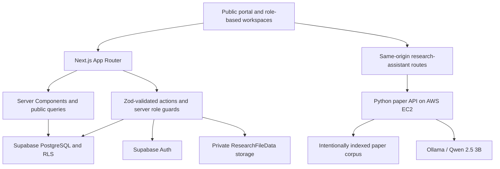

# Islington College R&D Digital Hub

**Team Neutron · Islington Hackathon 2026 · 12–13 September 2026**

Discover → Understand → Connect → Participate

A connected research discovery and participation platform for Islington College. Public visitors can explore research without an account, follow links between research areas, people, projects and publications, and understand how to get involved. Researchers submit work for review; administrators control institutional publishing.

This repository is a hackathon prototype, with completed features and remaining acceptance work distinguished below.

## Problem and proposed solution

Research information is spread across documents, webpages and communication channels. Even when records exist, their relationships are often missing: a student interested in Artificial Intelligence should be able to find relevant projects, see who works on them, read published outputs and express interest without knowing the department's internal structure.

The Hub stores connected records in one PostgreSQL database and reuses those relationships across public pages. Its two core journeys are:

1. **Discovery and participation:** search → research area → researcher/project → published output → project interest.
2. **Submission and maintenance:** upload → review/edit extracted details → submit privately → administrator review → publish → discover publicly.

The broader proposal includes events, grants, opportunities, analytics and richer AI discovery. The hackathon implementation prioritizes the connected research and publication workflows; unimplemented modules are not presented as working services.

## Implemented capabilities

| Area                     | Current behavior                                                                                                                                                                                                                  |
| ------------------------ | --------------------------------------------------------------------------------------------------------------------------------------------------------------------------------------------------------------------------------- |
| Public discovery         | Research areas, researcher profiles, projects and published publications with related-record navigation. Normal research information requires no login.                                                                           |
| Connected search         | `/search` groups results across all four entity types and uses public relationships as matching context. Ranking is deterministic lexical matching, not semantic/vector search.                                                   |
| Participation            | Signed-in students express interest in projects; administrators have an interest inbox.                                                                                                                                           |
| Researcher onboarding    | Every new account starts as a student. Users request researcher access from `/account`; administrators approve or reject it at `/admin/access`.                                                                                   |
| Publication intake       | Upload a completed DOCX or text-based PDF, extract editable title, abstract, authors, affiliations, sections, disclosures and references, then review before submitting. Optional fields need not all be filled.                  |
| Submission readiness     | Deterministic related-work suggestions, research-area/tag suggestions and structural reference checks. This is not plagiarism detection or certification of citation correctness.                                                 |
| Review workflow          | Researchers manage their own permitted drafts and resubmissions. Administrators start review, leave feedback, request changes and publish.                                                                                        |
| Administration           | Database-backed counts and configurable Needs Attention rules for stale reviews, changes requested and ongoing projects. These rules are not AI-generated institutional decisions.                                                |
| Research Paper Assistant | Ask grounded questions, see source paper/section, obtain lexical related-paper recommendations and compare two indexed papers. **Analyze this paper** opens the global assistant and selects an exact title match when available. |

PDF extraction is a starting point, not guaranteed recovery of a document's structure. Scanned/image-only PDFs are rejected with an honest no-text state; OCR is not implemented. Article uploads are limited to 10 MB, validated on the server and stored privately in `ResearchFileData`.

## Architecture and technology



- **Application:** Next.js App Router, React, strict TypeScript, Tailwind CSS and Lucide.
- **Backend:** Next.js server actions/route handlers, Supabase Auth, PostgreSQL, Storage, `@supabase/ssr` and Zod.
- **Document extraction:** Mammoth for DOCX and PDF.js for text-based PDFs.
- **Research intelligence:** separate Python service, Ollama and Qwen on AWS EC2.
- **Verification:** Node test runner, Docker-free PGlite PostgreSQL/RLS tests, ESLint, TypeScript and GitHub Actions.

Exact dependency versions are recorded in `package-lock.json`. Server Components handle ordinary reads; small Client Components handle interactive controls. Supabase owns account credentials and the database enforces authorization independently of the UI.

## AI agents and model disclosure

**Codex (OpenAI) and Antigravity (Google) were used as AI development agents for this project.** They assisted team members with scoped implementation, integration, debugging, testing and documentation. Their output is subject to human review; team members remain responsible for the code, permissions, data accuracy and acceptance of the delivered work.

**Qwen 2.5 3B through Ollama is a runtime product feature**, separate from the development agents. It answers against an intentionally indexed paper corpus and is configured with temperature `0.0`. It is not a general-purpose chatbot or a search engine for every Supabase record. If evidence is missing, the expected response is:

> Information not available in the provided document(s).

Grounding controls and tests reduce unsupported answers; they are not a guarantee of perfect model accuracy. Questions are independent: the visible transcript does not imply conversational memory. Related-paper recommendations use deterministic lexical overlap and do not require the model.

This explicit disclosure follows the participant handbook's requirement to name AI tools in the repository README.

## Security and data boundaries

| Role              | Access                                                                                     |
| ----------------- | ------------------------------------------------------------------------------------------ |
| Anonymous visitor | Public research discovery, published metadata and the public indexed-paper assistant.      |
| Student           | Public features, own account, project participation and own researcher-access request.     |
| Researcher        | Public features plus own permitted submissions, edits and private uploads. Cannot publish. |
| Administrator     | Authorized review, publishing, access-request and role-management workflows.               |

Roles come from `profiles` on the server, never user-supplied metadata. New accounts always start as students. Zod, RLS, storage policies and workflow triggers enforce input, ownership and lifecycle rules.

Private uploads, unpublished drafts and student information are **not automatically sent to Qwen**. Published metadata does not make an intake source file publicly downloadable. The assistant uses only the backend's intentionally indexed corpus.

The browser calls `/api/research-assistant/*`; the Next.js server adds the Qwen key. Never place backend secrets in `NEXT_PUBLIC_*` variables, browser code, logs or Git. All fictional institutional records must visibly say **DEMO DATA**.

## Local setup

Use Node.js **22.18 or newer** and npm. CI uses Node 22.

```sh
git clone https://github.com/naitik-joshi/hackathon-neutron.git
cd hackathon-neutron
git switch dev
npm ci
```

Copy `.env.example` to `.env.local` (`Copy-Item .env.example .env.local` in PowerShell, or `cp .env.example .env.local` in a Unix shell), then fill it privately:

```dotenv
NEXT_PUBLIC_SUPABASE_URL=
NEXT_PUBLIC_SUPABASE_PUBLISHABLE_KEY=
QWEN_BACKEND_URL=
QWEN_API_KEY=
SUPABASE_SERVICE_ROLE_KEY=
```

| Variable                               | Use                                                                                                              |
| -------------------------------------- | ---------------------------------------------------------------------------------------------------------------- |
| `NEXT_PUBLIC_SUPABASE_URL`             | Hosted Supabase project URL.                                                                                     |
| `NEXT_PUBLIC_SUPABASE_PUBLISHABLE_KEY` | Publishable key for normal access, protected by RLS.                                                             |
| `QWEN_BACKEND_URL`                     | Server-only Qwen service base URL; obtain privately from the backend owner.                                      |
| `QWEN_API_KEY`                         | Server-only credential for the Qwen service.                                                                     |
| `SUPABASE_SERVICE_ROLE_KEY`            | Optional, server-only credential for the protected admin invitation feature. Normal workflows do not require it. |

For an already configured hosted project:

```sh
npm run dev
```

Open [localhost:3000](http://localhost:3000). Restart after changing environment values. Missing configuration produces setup/unavailable states rather than fabricated data.

### Hosted database setup

Use the team's hosted development project; no local Docker stack is required. Coordinate with the database owner before applying migrations or seeds.

```sh
npx supabase login
npx supabase link --project-ref YOUR_PROJECT_REF
npx supabase db push --linked
```

Configure email/password Auth, the Site URL and allowed redirect URLs for the actual local/deployed application in Supabase. Migrations do not configure those dashboard settings. If email confirmation is enabled, verify the user's email before sign-in.

Provision the first administrator through trusted Supabase administration using the confirmed account's actual Auth UUID. Subsequent researcher requests and permitted role changes use the application workflow. Administrators cannot view or create users' passwords. See [testing and account setup](docs/testing.md) and [intake/access handoff](docs/article-intake-access-handoff.md).

### Demo data

The coordinated demo seed creates four areas, four fictional researchers, four projects and six published publications, with stable IDs and visible **DEMO DATA** labels. It creates no Auth accounts or passwords.

```sh
npx supabase db push --linked --include-seed
```

Search **Artificial Intelligence** to explore the connected demo records. Read [demo data and cleanup](docs/demo-data.md) before modifying or removing seeded content.

## Using the Research Paper Assistant

1. Open **Research assistant**, or **Analyze this paper** on a public publication.
2. An exact indexed title match selects the publication automatically; otherwise choose a paper explicitly.
3. Enter a question, optionally choose a section, and select **Analyze paper**.
4. For comparison, choose **Compare**, select a different second paper, enter a question and select **Compare papers**.

The action button sits in a persistent footer while the fields and messages scroll. It stays visible when disabled; choose the required paper(s), enter at least three characters and wait for the assistant to be ready.

The browser uses these same-origin routes:

| Method | Route                               | Purpose                |
| ------ | ----------------------------------- | ---------------------- |
| GET    | `/api/research-assistant/health`    | Availability           |
| GET    | `/api/research-assistant/papers`    | Indexed corpus         |
| POST   | `/api/research-assistant/query`     | Grounded question      |
| POST   | `/api/research-assistant/recommend` | Lexical recommendation |
| POST   | `/api/research-assistant/compare`   | Two-paper comparison   |

See the [Next.js integration contract](docs/qwen-frontend-integration.md) and [backend request/response guide](qwen-grounded-paper-system/FRONTEND_CONNECT_GUIDE.md). Model or backend failures show an unavailable/retry state; ordinary pages and submissions do not depend on Qwen.

## Checks and deployment

```sh
npm run lint
npm run typecheck
npm test
npm run build
npm run start
```

`npm run check` combines lint and typechecking. If the local environment prevents the default Turbopack build, the supported verification alternative is `npm run build -- --webpack`.

The application can be deployed to Vercel with the same environment variables and configured Supabase redirect URLs. Ensure hosting request-duration limits accommodate the bounded Qwen inference timeout; local success alone does not verify deployment behavior. The Qwen Python service is separately deployed on AWS EC2.

The previous integrated release passed 72 application tests, seven Python API tests, lint, TypeScript and a webpack production build. Hosted public search and same-origin Qwen health, papers, positive/missing-fact queries, recommendations and comparison passed. These are recorded results, not a claim that every hosted journey has been accepted.

## Known limitations and next work

- Complete authenticated hosted acceptance with disposable student, researcher and admin accounts: access approval, private file ownership, DOCX/PDF submission, review/resubmission/publishing and the interest inbox.
- Finish browser, keyboard and responsive acceptance. Optional admin invitations still need configured server credentials and a live acceptance test.
- Qwen transport currently uses plain HTTP demo infrastructure. Production needs HTTPS/private networking and restricted direct backend access.
- Rate limits are process-local; multiple hosting instances need shared enforcement.
- Search has bounded candidate/result limits and lexical ranking. Semantic search, usage analytics, notifications, full events/grants/opportunities modules, OCR, OAuth and password reset are not implemented.
- A full general-purpose institutional CMS and automatic private-document Qwen ingestion are outside the current scope.

The live application URL and final release readiness should be confirmed by the integration owner. See [final acceptance](docs/final-acceptance.md); do not treat a successful build as full production acceptance.

## Team and development workflow

| Member           | Primary responsibility                                                                           |
| ---------------- | ------------------------------------------------------------------------------------------------ |
| Naitik Joshi     | Backend integration, hosted database coordination, connected search and merge coordination.      |
| Rabin Bam        | Backend workflows, authorization, document intake, access approval and Qwen backend/integration. |
| Sambhav Shrestha | Public discovery UI, research areas, profiles and public components.                             |
| Millind Shakya   | Dashboard and participation UI, forms and responsive workspace experience.                       |

Feature ownership allows collaboration while reducing conflicts. Read [AGENTS.md](AGENTS.md), [architecture](docs/architecture.md), [work division](docs/work-division.md) and [project status](docs/project-status.md) before coding. Use real Linear issue IDs, small branches from `dev`, incremental commits and reviewed PRs. Coordinate shared files and every migration. Update only your own status section.

## Documentation and demo

- [Architecture](docs/architecture.md), [data model](docs/data-model.md) and [decisions](docs/decisions.md)
- [Backend workflows](docs/backend-handoff.md) and [document intake/access](docs/article-intake-access-handoff.md)
- [Submission readiness](docs/submission-preflight.md) and [Needs Attention](docs/research-operations.md)
- [Assistant integration](docs/qwen-frontend-integration.md) and [Qwen backend](qwen-grounded-paper-system/README.md)
- [Design system](docs/design-system.md) and [copy guidance](docs/copy-style.md)
- [Demo script](docs/demo-script.md), [testing](docs/testing.md) and [acceptance record](docs/final-acceptance.md)
- [Remaining build plan](docs/final-build-plan.md) and [team status](docs/project-status.md)

For the handbook's 3–5 minute demonstration, show public discovery and relationships, one grounded-paper interaction, then the private submission/review/publication journey using visibly marked demo data. Explain implemented behavior and remaining limits honestly.
