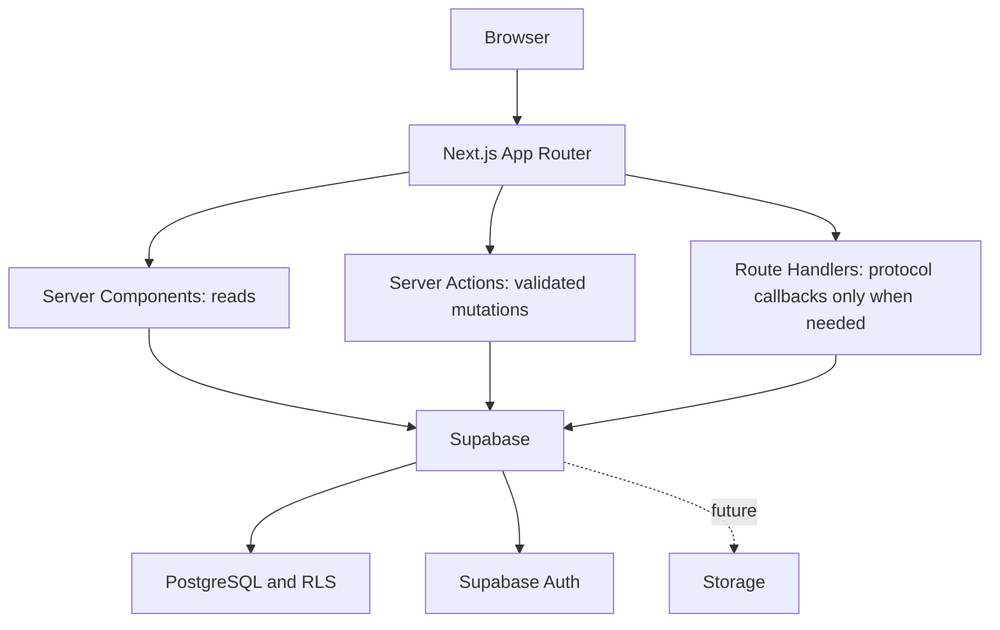

# Architecture

Client components handle pending forms and recoverable errors. Server Components render data; Server Actions validate inputs, verify identity and roles, then write through the user's Supabase session. No duplicate REST layer. PostgreSQL owns durable records, relationships, permissions and workflow invariants. Supabase Auth owns passwords and signed identity. Proxy refreshes cookies; server guards and RLS authorize requests independently.

Separate browser/server clients follow the [official Supabase SSR pattern](https://supabase.com/docs/guides/auth/server-side/creating-a-client?framework=nextjs). getClaims validates identity; profiles supplies the current role. Never trust user-editable metadata. Authenticated pages are dynamic; do not cache personalized responses at a CDN. Missing configuration produces a setup state, never fake records. No service-role credential is used.

A future AI layer must sit behind server boundaries, honor RLS and cite public sources. It is outside v0.1. Storage has no buckets or upload workflow yet. Admin shell sections represent backlog only.
