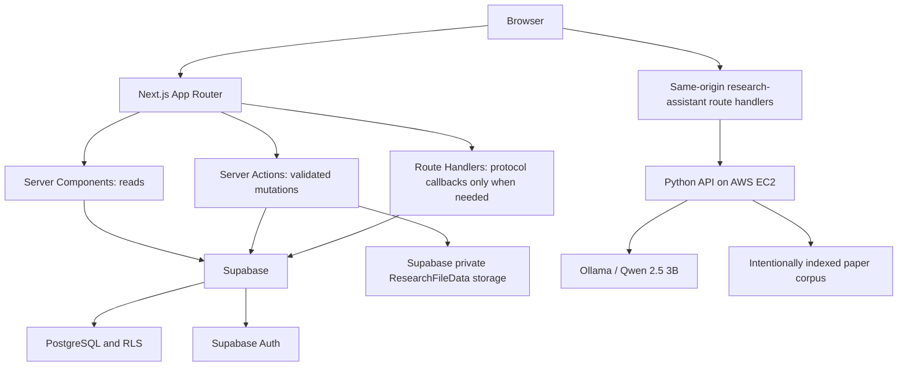

# Architecture

Client components handle pending forms and recoverable errors. Server Components render data; Server Actions validate inputs, verify identity and roles, then write through the user's Supabase session. No duplicate REST layer. PostgreSQL owns durable records, relationships, permissions and workflow invariants. Supabase Auth owns passwords and signed identity. Proxy refreshes cookies; server guards and RLS authorize requests independently.

Separate browser/server clients follow the [official Supabase SSR pattern](https://supabase.com/docs/guides/auth/server-side/creating-a-client?framework=nextjs). getClaims validates identity; profiles supplies the current role. Never trust user-editable metadata. Authenticated pages are dynamic; do not cache personalized responses at a CDN. Missing configuration produces a setup state, never fake records. Normal database and storage access uses the user's session. Only the optional, admin-authorized Auth invitation helper uses a server-only service-role credential; role promotion still goes through the signed-in administrator's guarded database function.

Document intake validates DOCX/text-based PDF uploads and extracts editable research fields on the server. Source files remain private in ResearchFileData with ownership-based storage policies. Researcher-access approval and publication transitions use trusted server logic plus database constraints/RLS. The admin workspace includes actual review, access, interest and operational-data flows.

Connected search reads public research areas, researchers, projects and published publications with deterministic lexical ranking. The optional assistant is independent of normal page rendering: the browser calls only Next.js routes, which validate inputs, attach the server-only Qwen credential and return no-store responses. It uses only its intentionally indexed corpus, never private submissions or student data. A model outage does not disable the rest of the Hub. Current EC2 HTTP transport and process-local rate limiting remain demo-infrastructure limitations.
