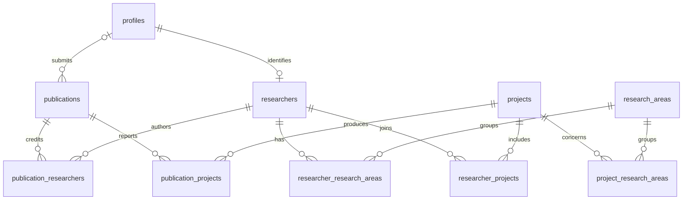

# Data model and RLS assumptions

PostgreSQL supports foreign keys, transactional publishing and many-to-many queries in this relationship-heavy domain.

profiles stores a private Auth-linked display name and role; deleting an Auth user cascades to their profile. researchers is an independently curated public identity, optionally linked one-to-one to a profile (SET NULL on deletion). research_areas groups ideas. projects stores proposed/ongoing/completed/archived public projects. publications stores abstract, DOI, year, immutable slug/attribution and review state; deleted submitters become NULL so outputs survive. Entity IDs are UUIDs; slugs are unique. Relationship pairs are composite primary keys with reverse indexes and cascading deletion. Core entities have creation/update timestamps.

Workflow: Draft → Submitted → Under Review → Changes Requested / Published / Rejected. Changes Requested → Submitted is allowed. Approval and publication are one explicit admin decision in v0.1; there is no separate approved enum. Publishing requires Under Review and sets published_at in the database. Researchers can insert Draft/Submitted and edit only their own Draft/Changes Requested records. Submitted, reviewed and published records are locked to researchers. The private researcher detail route exposes edit/resubmit only for editable states and renders owner-scoped review history.

RLS is enabled on all ten tables. Anonymous users read all admin-curated directory records and only published publications; this schema has no draft directory content. Students inherit public reads plus their own private profile. Researchers also read their own submissions. Admins manage all institutional rows and profiles. Self-service profile writes are deliberately absent to prevent role escalation. New Auth users always receive student, ignoring user metadata. Role provisioning is a trusted SQL/admin operation.

Publication relationship rows are visible only when their publication is visible under RLS. Researchers cannot modify relationships in v0.1. Directory relationships are public. No emails or credentials live in public identity tables. Workflow triggers restrict transitions and immutable attribution independently of UI. SECURITY DEFINER is confined to own-role lookup and profile creation with empty search_path. SQL owners bypass RLS for migrations and seed only; application clients use publishable credentials and user JWTs. RLS tests use PostgreSQL roles, not mocked permission functions.
