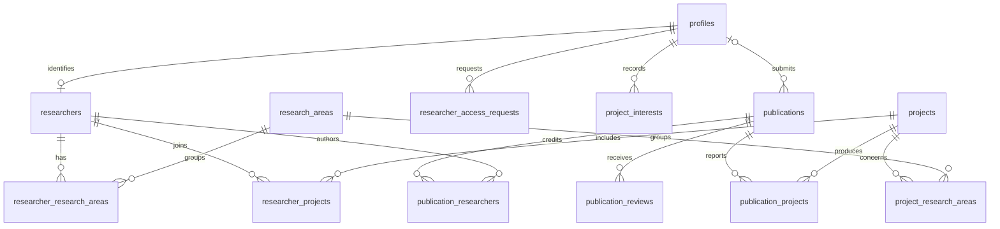

# Data model and RLS assumptions

PostgreSQL supports foreign keys, transactional publishing and many-to-many queries in this relationship-heavy domain.

profiles stores a private Auth-linked display name and role; deleting an Auth user cascades to their profile. researchers is an independently curated public identity, optionally linked one-to-one to a profile (SET NULL on deletion). research_areas groups ideas. projects stores proposed/ongoing/completed/archived public projects. publications stores abstract, DOI, year, immutable slug/attribution and review state; deleted submitters become NULL so outputs survive. Entity IDs are UUIDs; slugs are unique. Relationship pairs are composite primary keys with reverse indexes and cascading deletion. Core entities have creation/update timestamps.

Workflow: Draft → Submitted → Under Review → Changes Requested / Published / Rejected. Changes Requested → Submitted is allowed. Approval and publication are one explicit admin decision in v0.1; there is no separate approved enum. Publishing requires Under Review and sets published_at in the database. Researchers can insert Draft/Submitted and edit only their own Draft/Changes Requested records. Submitted, reviewed and published records are locked to researchers. The private researcher detail route exposes edit/resubmit only for editable states and renders owner-scoped review history.

New publication intake starts with a `.docx` or text-based `.pdf` using the institutional article template. The private object is stored in the private `ResearchFileData` bucket under a generated UUID path inside the authenticated researcher's UUID folder. `publications.document_path`, sanitized `document_name` and `document_mime_type` identify that object; `document_metadata` stores the validated, user-corrected optional template fields. Title and abstract remain first-class required columns. Legacy publications may have no document. Document identity and extracted metadata are immutable after submission. Source-document reads remain private to the owning researcher and administrators even after publication; normal publication information remains publicly readable without login. Image-only scanned PDFs require OCR before upload and are rejected when no extractable text is available.

Every self-registered Auth user still starts as a student. A student may insert a private `researcher_access_requests` row for their own account. Only the requester and administrators can read it. The database permits one pending request per user; rejected users may submit a later request. The narrowly granted `review_researcher_access_request` function checks the caller's database-backed admin role and atomically records the decision plus promotion to researcher. `admin_set_profile_role` allows an admin to manage an existing account but prevents self-role changes. These functions never handle credentials or create Auth users.

RLS is enabled on all exposed public tables. Anonymous users read all admin-curated directory records and only published publications; private review, interest and access-request tables are excluded. Students inherit public reads plus their own private profile, project interests and access requests. Researchers also read their own submissions. Admins manage institutional rows and may review private workflows. Self-service profile writes are deliberately absent to prevent role escalation. New Auth users always receive student, ignoring user metadata. Role provisioning is a database-checked admin operation.

Publication relationship rows are visible only when their publication is visible under RLS. Researchers cannot modify relationships in v0.1. Directory relationships are public. No emails or credentials live in public identity tables. Workflow triggers restrict transitions and immutable attribution independently of UI. SECURITY DEFINER functions use an empty search path, explicit object qualification, database-role checks and narrow execute grants. SQL owners bypass RLS for migrations and seed only; application clients use publishable credentials and user JWTs. RLS tests use PostgreSQL roles, not mocked permission functions.
