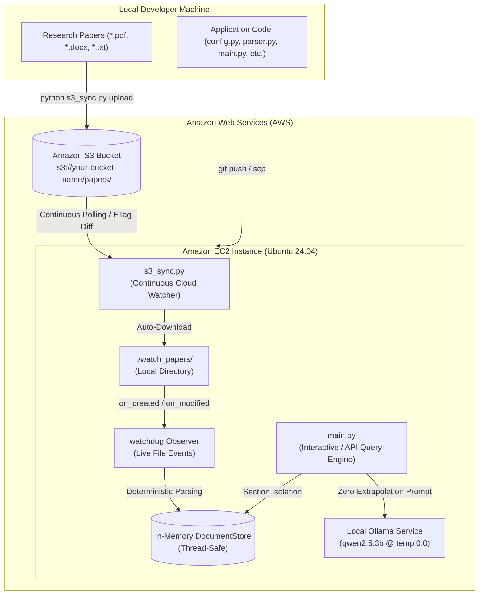

# AWS Deployment & Cloud Architecture Guide
## Closed-Domain Grounded Document Analysis System

This guide outlines the complete step-by-step procedure to deploy the grounded research paper analysis system on **Amazon Web Services (AWS)** using **Amazon S3** (for the dataset lake) and **Amazon EC2** (for compute and Ollama `qwen2.5:3b` inference).

---

## 1. Cloud Architecture Overview



---

## 2. File-to-Service Mapping

| Service | Files to Store / Deploy | What NOT to Upload |
|---|---|---|
| **Amazon S3**<br>*(Object Storage)* | **Dataset Documents Only**:<br>• `.pdf` research papers (e.g. `IJMR_*.pdf`)<br>• `.docx` papers (e.g. `sample_paper.docx`, `ARTICLETEMPLATE.docx`)<br>• `.txt` papers (e.g. `sample_paper_2.txt`) | Do **not** upload python code, virtual environments, or temporary files here. |
| **Amazon EC2**<br>*(Compute & Inference)* | **Source Code & Configurations**:<br>• `config.py`<br>• `parser.py`<br>• `store.py`<br>• `watcher.py`<br>• `ollama_bridge.py`<br>• `s3_sync.py`<br>• `main.py`<br>• `requirements.txt`<br>• `AGENTS.md`<br>• Local test files (`benchmark_grounding.py`, etc.) | **Do NOT upload the 6GB `*.safetensors` files!**<br>Ollama on EC2 downloads `qwen2.5:3b` in ~10 seconds over AWS’s high-speed backbone. |

---

## 3. Step-by-Step Deployment Instructions

### Step 1: Create the Amazon S3 Bucket
1. Log into the [AWS Management Console](https://console.aws.amazon.com/) and navigate to **S3**.
2. Click **Create bucket**.
3. Choose a unique name, e.g., `my-research-papers-dataset-2026`.
4. Select your preferred AWS Region (e.g., `us-east-1`).
5. Leave default settings (Block Public Access: **ON**).
6. Click **Create bucket**.

---

### Step 2: Upload Your Research Papers from Local Machine to S3
Open PowerShell in `c:\Users\ASUS\Downloads\Qwen`:

```powershell
# Set your AWS credentials
$env:AWS_ACCESS_KEY_ID = "YOUR_AWS_ACCESS_KEY_ID"
$env:AWS_SECRET_ACCESS_KEY = "YOUR_AWS_SECRET_ACCESS_KEY"
$env:AWS_DEFAULT_REGION = "us-east-1"
$env:AWS_S3_BUCKET = "my-research-papers-dataset-2026"

# Upload all papers to the S3 bucket under the 'papers/' prefix
python s3_sync.py upload --bucket my-research-papers-dataset-2026 --prefix papers/
```

---

### Step 3: Launch the Amazon EC2 Instance
1. In the AWS Console, open **EC2** $\to$ click **Launch instances**.
2. **Name**: `qwen-grounded-analysis-server`.
3. **AMI**: **Ubuntu Server 24.04 LTS (HVM)**, SSD Volume Type.
4. **Instance Type**:
   - **CPU Option (Cost-Effective)**: `t3.xlarge` (4 vCPU, 16 GB RAM) – ~$0.16/hour. Runs Qwen 2.5:3B smoothly.
   - **GPU Option (High Throughput)**: `g4dn.xlarge` (NVIDIA T4 GPU, 16 GB RAM) – ~$0.52/hour. Sub-second inference.
5. **Key Pair**: Select or create an SSH key pair (`my-key.pem`).
6. **Storage**: Set storage to at least **50 GB** (gp3).
7. **IAM Instance Profile (Recommended)**:
   - Attach an IAM role with `AmazonS3FullAccess` (or read/write access to your specific bucket) so the instance authenticates with S3 passwordlessly.
8. Click **Launch instance**.

---

### Step 4: Configure the EC2 Server
Connect to your EC2 instance via SSH:
```bash
ssh -i "my-key.pem" ubuntu@<YOUR_EC2_PUBLIC_IP>
```

Update system packages and install prerequisites:
```bash
# 1. Update packages
sudo apt update && sudo apt upgrade -y
sudo apt install -y python3-pip python3-venv git curl

# 2. Install Ollama
curl -fsSL https://ollama.com/install.sh | sh

# 3. Pull the Qwen 2.5:3b model into Ollama
ollama pull qwen2.5:3b
```

---

### Step 5: Transfer Application Code to EC2
From your **local machine**, transfer the core code files to EC2:

```powershell
# Run from c:\Users\ASUS\Downloads\Qwen on your local machine:
scp -i "my-key.pem" config.py parser.py store.py watcher.py ollama_bridge.py s3_sync.py main.py requirements.txt AGENTS.md benchmark_grounding.py test_live_mutation.py test_system.py ubuntu@<YOUR_EC2_PUBLIC_IP>:~/app/
```

*(Alternatively, push your code to a private GitHub/GitLab repository and run `git clone` inside `~/app` on EC2).*

---

### Step 6: Setup Python Environment on EC2
Back in your EC2 SSH terminal:

```bash
cd ~/app

# Create virtual environment
python3 -m venv venv
source venv/bin/activate

# Install dependencies
pip install --upgrade pip
pip install -r requirements.txt

# Initial pull of all research papers from S3 into ./watch_papers
export AWS_S3_BUCKET="my-research-papers-dataset-2026"
export AWS_DEFAULT_REGION="us-east-1"
python s3_sync.py pull --bucket $AWS_S3_BUCKET --prefix papers/
```

---

### Step 7: Running the Live System on AWS

You can run the system with dual-watch capability:

#### Terminal 1: Background Cloud Synchronizer (S3 Watcher)
Runs continuously in the background, polling S3 every 15 seconds for newly added or revised papers:
```bash
python s3_sync.py watch-s3 --bucket $AWS_S3_BUCKET --interval 15
```

#### Terminal 2: Interactive Grounded Query CLI
Runs the live system with closed-domain grounding:
```bash
python main.py run
```

---

## 4. How the Automated Self-Updating Dataset Works
1. When you or another team member upload or update a document in `s3://my-research-papers-dataset-2026/papers/`:
2. `s3_sync.py` detects the new ETag / modification timestamp and downloads the file to `./watch_papers/`.
3. `watchdog` automatically catches the filesystem event and deterministic parser segments the document into the canonical sections.
4. The in-memory `DocumentStore` re-indexes the document live.
5. All subsequent queries immediately reflect the updated document content with **zero server restart and zero downtime**.

---

## 5. Useful Verification Commands on EC2
```bash
# Verify all documents are indexed
python main.py list

# Run the automated grounding benchmark (Accuracy, Rejection, Latency)
python benchmark_grounding.py

# Run the live in-flight mutation test
python test_live_mutation.py

# Run full integration test suite
python test_system.py
```
