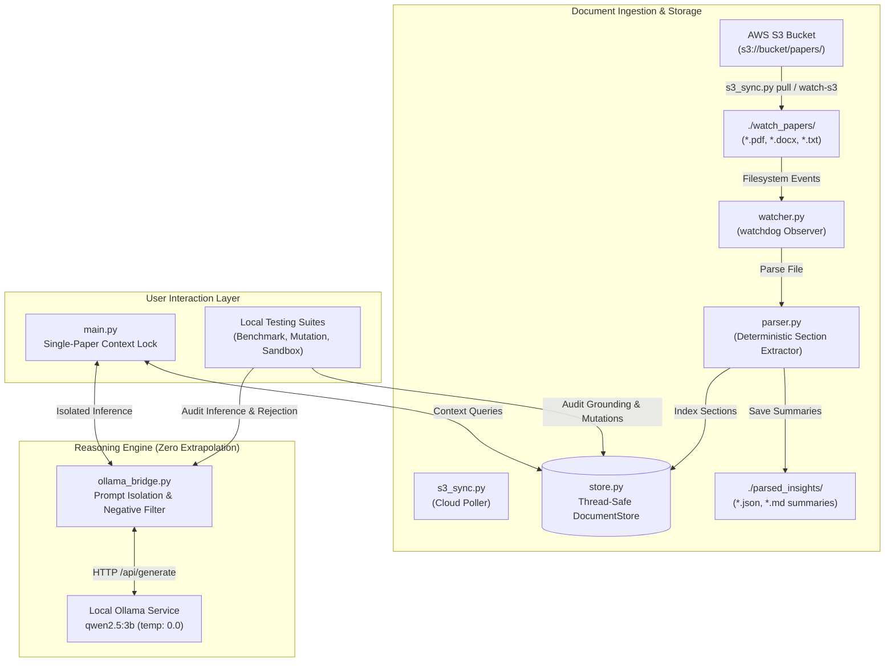

# Closed-Domain Research Paper Analysis System: Complete System & Deployment Manual

This guide serves as the definitive reference for the automated, closed-domain research paper analysis system built in accordance with [AGENTS.md](file:///c:/Users/ASUS/Downloads/Qwen/AGENTS.md).

---

## Table of Contents
1. [System Architecture & Core Principles](#1-system-architecture--core-principles)
2. [File Manifest: Local vs. AWS S3 vs. AWS EC2](#2-file-manifest-local-vs-aws-s3-vs-aws-ec2)
3. [Target Research Paper Template Schema](#3-target-research-paper-template-schema)
4. [Step-by-Step AWS Setup & Cloud Sync](#4-step-by-step-aws-setup--cloud-sync)
5. [Local Execution & Interactive CLI Guide](#5-local-execution--interactive-cli-guide)
6. [Testing & Verification Methods](#6-testing--verification-methods)
7. [Grounding & Zero-Extrapolation Guardrails](#7-grounding--zero-extrapolation-guardrails)

---

## 1. System Architecture & Core Principles

The system guarantees **100% factual grounding** on academic research papers with **zero hallucination or extrapolation**:



### Core Tenets
1. **Single-Paper Session Context**: Once a document is selected (`use <paper>`), queries are isolated strictly to that document. Cross-paper contamination is strictly prevented.
2. **Hard Negative Rejection**: If any requested metric, claim, table, or explanation is absent, the system responds strictly:
   > `"Information not available in the provided document(s)."`
3. **Dynamic Hot-Reloading**: Adding, modifying, or deleting files in `./watch_papers/` (or in AWS S3) instantly synchronizes in-memory state without server restarts.

---

## 2. File Manifest: Local vs. AWS S3 vs. AWS EC2

### Where Every File Belongs

| File / Directory | Local Machine | AWS S3 Bucket | AWS EC2 Server | Description |
|---|:---:|:---:|:---:|---|
| **`watch_papers/`** (PDFs, DOCX, TXT) | ✅ Keep | ✅ **Upload Here** (`s3://.../papers/`) | ✅ Auto-synced | Source research papers dataset |
| **`s3_sync.py`** | ✅ Run | ❌ No | ✅ Run | Cloud sync utility (upload, pull, continuous poll) |
| **`config.py`** | ✅ Keep | ❌ No | ✅ Deploy | Schema section headers, regex patterns, Ollama URLs |
| **`parser.py`** | ✅ Keep | ❌ No | ✅ Deploy | Multi-format parser preserving paragraph & table order |
| **`store.py`** | ✅ Keep | ❌ No | ✅ Deploy | In-memory document store & similarity calculator |
| **`watcher.py`** | ✅ Keep | ❌ No | ✅ Deploy | `watchdog` live filesystem event monitor |
| **`ollama_bridge.py`** | ✅ Keep | ❌ No | ✅ Deploy | Zero-temperature Ollama bridge with negative prompt guard |
| **`main.py`** | ✅ Run | ❌ No | ✅ Run | Interactive CLI with single-paper context lock |
| **`requirements.txt`** | ✅ Keep | ❌ No | ✅ Deploy | Python dependencies (`python-docx`, `pypdf`, `watchdog`, etc.) |
| **`AGENTS.md`** | ✅ Keep | ❌ No | ✅ Deploy | System rules & schema enforcement specification |
| **`benchmark_grounding.py`** | ✅ Run | ❌ No | ✅ Run | Grounding audit benchmark (Accuracy, Rejection, Latency) |
| **`test_live_mutation.py`** | ✅ Run | ❌ No | ✅ Run | Hot-reload live mutation test |
| **`test_cli_sandbox.py`** | ✅ Run | ❌ No | ✅ Run | Multi-turn CLI user journey sandbox test |
| **`test_system.py`** | ✅ Run | ❌ No | ✅ Run | 7/7 automated integration test suite |
| **`*.safetensors`** (6 GB files) | ⚠️ Local only | ❌ **Do NOT upload** | ❌ **Do NOT upload** | Raw HuggingFace weights (Ollama pulls `qwen2.5:3b` directly) |

---

## 3. Target Research Paper Template Schema

All parsed documents are deterministically organized into the following canonical 18-part schema:

1. **Header block** (Title, Authors, Affiliations, Date, Correspondence)
2. **Abstract** (150–250 words)
3. **Keywords** (Maximum 5)
4. **1. Introduction**
5. **2. Literature and Related Work** (including sub-sections 2.1, 2.2, etc.)
6. **3. Methodology / Approach**
7. **4. Results and Discussion** (including tables, figures, sub-sections)
8. **5. Conclusion**
9. **Disclosure Statement**
10. **Ethical Approval**
11. **Consent to Participate / Consent to Publish**
12. **Data Availability Statement**
13. **Use of Artificial Intelligence (AI) Tools**
14. **Authors’ Contributions**
15. **Funding**
16. **Competing Interests**
17. **Acknowledgements**
18. **References** (Harvard Author–Date format)

---

## 4. Step-by-Step AWS Setup & Cloud Sync

### Phase 1: Configure S3 Bucket on AWS
1. Open the [AWS S3 Console](https://s3.console.aws.amazon.com/).
2. Create a bucket (e.g., `my-research-papers-dataset-2026`).
3. Keep default settings (Block all public access enabled).

### Phase 2: Upload Local Dataset to S3
From your local machine in PowerShell:
```powershell
# Set credentials
$env:AWS_ACCESS_KEY_ID = "YOUR_ACCESS_KEY"
$env:AWS_SECRET_ACCESS_KEY = "YOUR_SECRET_KEY"
$env:AWS_DEFAULT_REGION = "us-east-1"

# Upload all files from ./watch_papers into s3://my-research-papers-dataset-2026/papers/
python s3_sync.py upload --bucket my-research-papers-dataset-2026 --prefix papers/
```

### Phase 3: Launch & Setup Amazon EC2
1. Launch an EC2 instance:
   - **Recommended CPU Instance**: `t3.xlarge` (4 vCPU, 16 GB RAM) - ~$0.16/hour.
   - **Recommended GPU Instance**: `g4dn.xlarge` (NVIDIA T4, 16 GB RAM) - ~$0.52/hour.
   - **OS**: Ubuntu 24.04 LTS.
   - **Storage**: 50 GB gp3.
   - **IAM Role**: Attach an IAM role with S3 Read permissions.
2. Connect to the instance:
   ```bash
   ssh -i "my-key.pem" ubuntu@<YOUR_EC2_PUBLIC_IP>
   ```
3. Install Ollama and pull `qwen2.5:3b`:
   ```bash
   sudo apt update && sudo apt install -y python3-pip python3-venv git curl
   curl -fsSL https://ollama.com/install.sh | sh
   ollama pull qwen2.5:3b
   ```
4. Transfer code and setup environment:
   ```bash
   mkdir -p ~/app && cd ~/app
   python3 -m venv venv
   source venv/bin/activate
   pip install -r requirements.txt
   ```
5. Pull initial dataset from S3:
   ```bash
   python s3_sync.py pull --bucket my-research-papers-dataset-2026 --prefix papers/
   ```

### Phase 4: Running Continuous Sync on AWS
Run dual-process execution:
```bash
# Terminal 1: Continuously poll S3 every 15s for uploaded/revised papers
python s3_sync.py watch-s3 --bucket my-research-papers-dataset-2026 --interval 15

# Terminal 2: Interactive analysis CLI
python main.py run
```

---

## 5. Local Execution & Interactive CLI Guide

To launch the system locally on Windows:
```powershell
python main.py run
```

### CLI Command Reference

| Command | Syntax | Description |
|---|---|---|
| **Lock Paper** | `use <paper_name>` | Locks session context to a single research paper (e.g., `use IJMR_Volume_1`). |
| **Active Paper** | `current` | Shows the currently active paper and its parsed sections. |
| **Unlock** | `clear_paper` | Unlocks context back to dataset-wide mode. |
| **List Papers** | `list` | Displays all indexed papers and their section counts. |
| **Inspect Section** | `show <section_name>` | Prints the raw extracted text of a section in the active paper. |
| **Find Similar** | `similar` | Ranks other papers in the dataset by keyword and abstract overlap. |
| **Compare Papers** | `compare <paper1> and <paper2>` | Performs side-by-side grounded comparison between two papers. |
| **Ask Question** | `<any question>` | Answers strictly from the active paper's relevant section(s). |

---

## 6. Testing & Verification Methods

Four dedicated testing tools are included to validate system correctness, grounding compliance, and runtime performance:

### Method 1: Grounding Benchmark (`benchmark_grounding.py`)
Measures factual accuracy, hard negative rejection, and inference latency across a comprehensive test matrix:
```powershell
python benchmark_grounding.py
```
*Expected output: 100% factual positive accuracy, 0.0% hallucination rate, ~600–700ms average latency.*

### Method 2: Live In-Flight Mutation Test (`test_live_mutation.py`)
Modifies a paper's metrics on disk while the system is running and verifies that the in-memory store and Ollama responses update dynamically:
```powershell
python test_live_mutation.py
```

### Method 3: Multi-Turn CLI Sandbox (`test_cli_sandbox.py`)
Simulates an end-to-end user journey: locking a paper, querying facts, testing negative rejection, exploring similarities, and comparing papers:
```powershell
python test_cli_sandbox.py
```

### Method 4: Automated Integration Suite (`test_system.py`)
Executes unit and integration assertions across parser extraction, live watcher events, document store indexing, and boundary enforcement:
```powershell
python test_system.py
```

---

## 7. Grounding & Zero-Extrapolation Guardrails

To prevent LLM hallucinations, the system implements a 3-layer guardrail architecture:

1. **Section Isolation**:
   When a user asks about a specific topic (e.g., "What dataset was used?"), the store isolates candidate sections (e.g., `3. Methodology / Approach`) before sending context to the model.
2. **Zero-Temperature Inference**:
   Inference is executed strictly with `temperature: 0.0` to ensure completely deterministic, reproducible output.
3. **Strict Negative System Prompting**:
   ```
   You are an analytical assistant operating strictly on the provided document excerpts.
   - You must NOT guess, extrapolate, or assume any facts.
   - If the requested information is absent, your response MUST be exactly:
     "Information not available in the provided document(s)."
   ```
If an adversary or user asks about external facts, unmentioned models, or missing metrics, the system returns the canonical rejection string every time.
